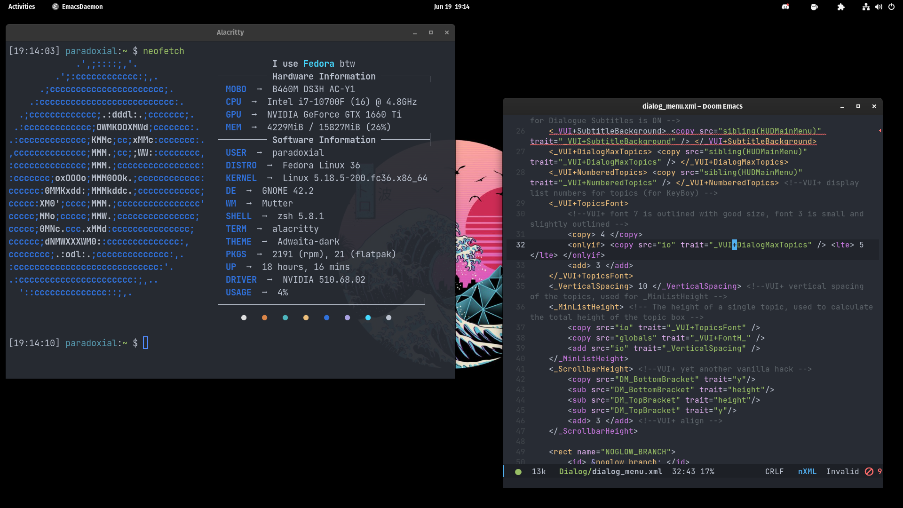

# dotfiles

A set of simple dotfiles for Fedora for the applications I use, consisting of my zsh configuration, settings for Alacritty and Kitty (even though I like Alacritty more) my light NeoVim config, as well as the config.el and init.el for DOOM Emacs.

ZSH has my favorite prompt, autocompletion, and syntax highlighting, which you can setup with `apply.sh`

`doom.sh` automates the process of installing DOOM Emacs (after its done put my configs and run `doom sync` in zsh or do it some other way idc)

You can also take a look at my wallpaper, and my GNOME Extensions (There are a lot)

Nothing else to it really

Have fun if you want to I guess

