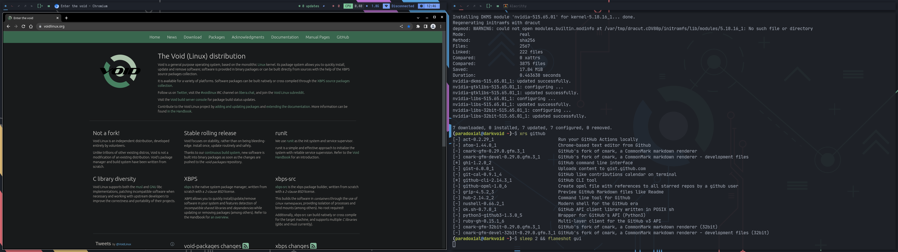

# dotfiles

This is old as shit as I no longer use Fedora on my personal machine, I use Void Linux. I will try to migrate to a new repository with some bootstrapping scripts as well as possibly ;looking into making a build server that makes nightly ISO's with my configs. Use at your own risk. 

A set of dotfiles for Fedora for the applications I use, consisting of my zsh configuration, settings for Alacritty and Kitty (even though I like Alacritty more) my light NeoVim config, as well as the config.el and init.el for DOOM Emacs.

God i'm starting to look into wayland alternatives whats wrong with me lol

Theres also my entire i3-gaps rice that very badly uses the nord color scheme but I'mma gloss over that.

ZSH has my favorite prompt, autocompletion, and syntax highlighting, which you can setup with `apply.sh`

`doom.sh` automates the process of installing DOOM Emacs (after its done put my configs and run `doom sync` in zsh or do it some other way idc)

You can also take a look at my wallpaper, and my GNOME Extensions (There are a lot)

Nothing else to it really

Have fun if you want to I guess

